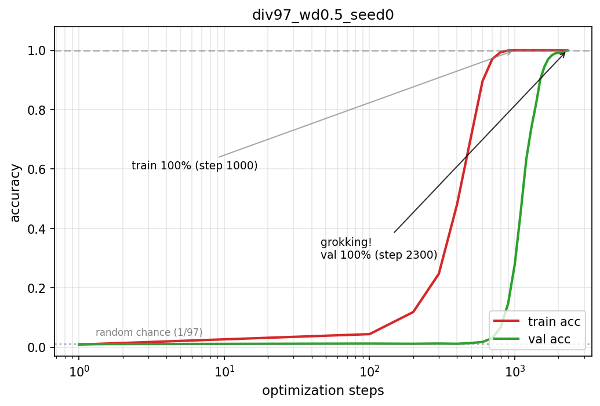

# Grokking 复现笔记：从记忆到泛化的延迟涌现

> 复现Power et al. (2022) 的 [Grokking: Generalization Beyond Overfitting on Small Algorithmic Datasets](https://arxiv.org/abs/2201.02177)


## 1. 实验设置

构造数据集：`模 97 除法`：

- **运算**：`x / y mod 97`（即 `x · y⁻¹ mod 97`，`y ≠ 0`），只保留这一种运算
- **格式**：明文 token 序列 `<x> <op> <y> <=> <answer>`，共 5 个 token
- **训练比例**：9312 条（97×96，排除 y=0），训练/验证各 4656 条

```python
# dataset.py (core logic)
def binary_div(x: int, y: int, p: int) -> int:
    """Modular division: x / y = x * y^(-1) (mod p). Requires y != 0."""
    return (x * pow(y, -1, p)) % p

def generate_equations(p: int):
    """Enumerate all valid (x, y, answer) triples for x / y mod p."""
    equations = []
    for x in range(p):
        for y in range(1, p):  # y = 0 is excluded
            equations.append((x, y, binary_div(x, y, p)))
    return equations
```

生成数据命令：

```bash
python src/dataset.py --p 97 --train-frac 0.5 --out-dir data
```

## 2. 训练模型

| 配置项 | 值 |
|--------|-----|
| 层数 | 2 |
| 宽度 (d_model) | 128 |
| 注意力头数 | 4 |
| FFN 维度 | 512 (4×d_model) |
| 序列长度 | 5 |
| 词表大小 | 99（97 个残差符号 + `<op>` + `<=>`） |
| 参数量 | **422,784**（≈ 论文 4×10⁵） |


| 模型结构 | 值 |
|--------|-----|
| 编码器 | transformer的encoder |
| 解码器 | linear，不需要自回归生成 |


训练命令：

```bash
# 开始训练模型
python src/train.py --steps 100000 --wd 1.0

## 论文 Figure 1 风格（full-batch，无 weight decay，grokking 极晚出现）：
python src/train.py --wd 0.0 --full-batch

# 启动tensorboard，访问http://localhost:6006/
tensorboard --logdir ./runs --port 6006
```


## 3. 复现Grokking曲线

训练完成后，绘制Accuracy曲线：
```
python src/plot_acc.py --csv ./runs/div97_wd0.5_seed0/train_log.csv
```




## 附：从 Adam 到 AdamW，为什么wd影响grokking出现的时机？

**Adam** 的每步更新长这样（ $g_t$ 是当前梯度， $\eta$ 是学习率）：

$$
m_t = \beta_1 m_{t-1} + (1-\beta_1) g_t \qquad v_t = \beta_2 v_{t-1} + (1-\beta_2) g_t^2
$$

$$
\theta_t = \theta_{t-1} - \eta \cdot \frac{m_t}{\sqrt{v_t} + \epsilon}
$$

- $m_t$：最近几十步梯度的**平均方向**——这个参数"总体想往哪走"
- $v_t$：最近几十步梯度的**平均抖动**——这个参数"说话有多吵"
- $m_t / \sqrt{v_t}$：**共识除以噪声**。方向笃定的参数迈大步，忽左忽右的参数迈小步。每个方向盘自带速度调节，这就是"自适应"

**AdamW** 只改了一处——在更新量后面多加一项 $\lambda\theta$：

$$
\theta_t = \theta_{t-1} - \eta \left( \frac{m_t}{\sqrt{v_t} + \epsilon} + \color{red}{\lambda\, \theta_{t-1}} \right) \\

\theta_t = \theta_{t-1} - \eta \left( \frac{m_t}{\sqrt{v_t} + \epsilon} + {\color{red} \lambda, \theta_{t-1}} \right)
$$

红色这项就是 weight decay：**不看梯度，每一步都把权重朝原点等比例拽回一点**。权重越大拽得越狠，永远在场。

**它怎么触发 grokking：** 训练 loss 归零后 $g_t \approx 0$，$m_t, v_t \to 0$，自适应项消失，更新只剩

$$
\theta_t = (1 - \eta\lambda)\, \theta_{t-1}
$$

——纯粹的等比缩水。而"背答案"的解需要大权重才背得死，被拽瘦之后撑不住，网络只好换成小块头的"真算法"解，验证集随即起飞。反过来 $\lambda=0$，过拟合后几乎没有任何力推它动，grokking 就被拖到几十万步之后。

___


## 参考

- Power, A., Burda, Y., Edwards, H., Babuschkin, I., & Misra, V. (2022). *Grokking: Generalization Beyond Overfitting on Small Algorithmic Datasets*. arXiv:2201.02177.
